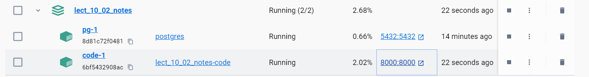

# PYTHON. DJANGO. LECTION EXAMPLE - NOTES.

## TASK
Проект, що реалізується в цьому розділі, — система управління нотатками на основі фреймворку Django. Користувач може додавати нотатки та описи до них. Додавати будь-яку кількість тегів у нотатці, а, значить, і створювати унікальні для себе теги. Нотатки можуть бути позначені як виконані або можуть бути видалені як не актуальні. Також ми додамо в проект авторизацію та аутентифікацію користувачів, можливість завантажувати аватарку для користувача.

## RESULT


### DOCKER

```
scipts/docker_build_docker-compose.cmd
[+] Building 28.8s (13/13) FINISHED                                                                                  docker:default
 => [code internal] load build definition from Dockerfile                                                                      0.1s
 => => transferring dockerfile: 1.11kB                                                                                         0.0s 
 => [code internal] load .dockerignore                                                                                         0.1s 
 => => transferring context: 154B                                                                                              0.0s 
 => [code internal] load metadata for docker.io/library/python:3.11                                                            2.7s 
 => [code auth] library/python:pull token for registry-1.docker.io                                                             0.0s
 => [code 1/7] FROM docker.io/library/python:3.11@sha256:652c9f890a7f38bab4d67ee95c54d72955792623122cfea0a87aa74d927e41ae      0.1s
 => => resolve docker.io/library/python:3.11@sha256:652c9f890a7f38bab4d67ee95c54d72955792623122cfea0a87aa74d927e41ae           0.1s 
 => [code internal] load build context                                                                                         0.1s
 => => transferring context: 5.15kB                                                                                            0.0s
 => CACHED [code 2/7] WORKDIR /app                                                                                             0.0s
 => [code 3/7] COPY . .                                                                                                        0.1s
 => [code 4/7] COPY run.sh run.sh                                                                                              0.1s
 => [code 5/7] COPY notes/ notes/                                                                                              0.1s
 => [code 6/7] COPY requirements.txt requirements.txt                                                                          0.1s
 => [code 7/7] RUN pip install -r requirements.txt                                                                            23.9s
 => [code] exporting to image                                                                                                  1.3s
 => => exporting layers                                                                                                        1.3s
 => => writing image sha256:e019f6cb476c7abd1394edd3c3ad106d29bb0b9aa45ab04ba521db24c4e38806                                   0.0s
 => => naming to docker.io/library/lect_10_02_notes-code                                                                       0.0s
[+] Running 2/2
 ✔ Container lect_10_02_notes-pg-1    Running                                                                                  0.0s
 ✔ Container lect_10_02_notes-code-1  Started                                                                                 14.3s
 ```




